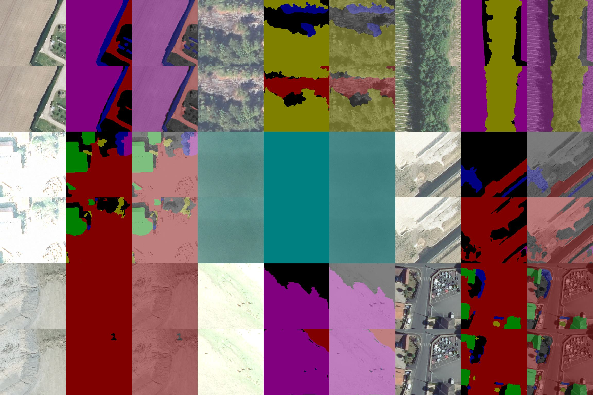

## Evaluating Segmentation Models on Aerial Datasets

### Description
This project envisions benchmarking segmentation models on aerial imagery dataset. 

 The project systematically evaluates and compares the performance of various segmentation algorithms, such as U-Net, DeepLab, HRNet, and SegNet on aerial datasets to assess their effectiveness in tasks like land cover classification.


#### Contact Person
The mainainer <[Kbostanov95@gmail.com](mailto:Kbostanov95@gmail.com)>

## Installation

```bash
git clone https://github.com/General-992/aerial-segmentation-models.git
cd $your-repository$

install libraries:
pip install -r requirements.txt

or if using conda:
conda env create -f torchsegm.yml

```

## Testing or Training the Models on your Dataset

See [example](example).

## Accuracy

|  Model     |              Origin              | epoch | Accuracy |  Mean IU  |
|:----------:|:--------------------------------:|:-----:|:--------:|:---------:|
|   Unet++   | [link](https://github.com/MrGiovanni/UNetPlusPlus) |  100  |    **83.9**    | **60.8** |
| DeepLabV3+ | [link](https://github.com/VainF/DeepLabV3Plus-Pytorch) |  100  |    **84.41**     | **61.2** |
|   SegNet   | [link](https://github.com/tkuanlun350/SegNet)  |  100  |    **74.11**     | **54.15** |
|  HRNetV2   | [link](https://github.com/HRNet/HRNet-Image-Classification) |  100  |    **84.34**     | **61.8** |

Visualization of segmentation of HRNetV2:




